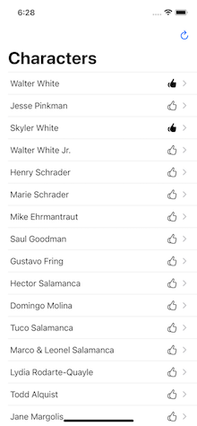
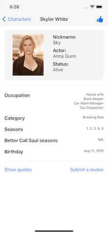
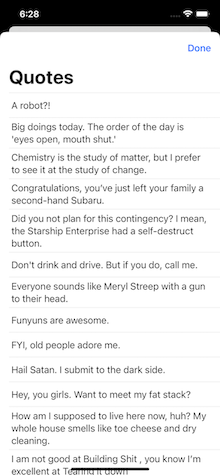
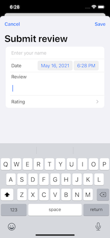
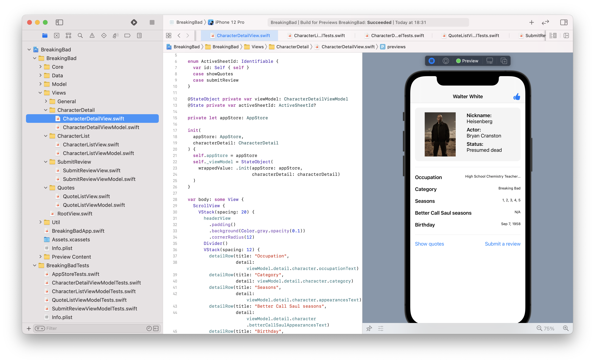

## Breaking Bad Demo app

- This demo app requires iOS 14 and Xcode 12.5
- No 3rd party libraries have been used
- I've used SwiftUI for the views (however, the MVVM approach is equally applicable to a UIKit app).

## Screenshots






## App Architecture

### AppStore
The app's main "source of truth". All app state is derived from this and all state mutations (e.g. liking a character, submitting a review) are sent here

### App Environment
Holds all the dependencies for the app (e.g. api clients, key value storage etc). A "fake" environment is used for previews and unit tests.

### Model layer
Holds all the data models needed to run the app (e.g. transformed JSON models)

### View layer
Holds all the (SwiftUI) views and view models. The view models take inputs (e.g. a subject) and map them to outputs (e.g. published state). This input-output mapping makes it easier to unit test.


## Previews / offline mode

The app is able to run completely in an offline mode using fake data, fake API clients etc. For example:
 



## Unit tests

All view models and the main app store have unit tests

## License

```
Copyright 2021 Ridgeview Consulting Limited.

Licensed under the Apache License, Version 2.0 (the "License");
you may not use this file except in compliance with the License.
You may obtain a copy of the License at

   http://www.apache.org/licenses/LICENSE-2.0

Unless required by applicable law or agreed to in writing, software
distributed under the License is distributed on an "AS IS" BASIS,
WITHOUT WARRANTIES OR CONDITIONS OF ANY KIND, either express or implied.
See the License for the specific language governing permissions and
limitations under the License.
```